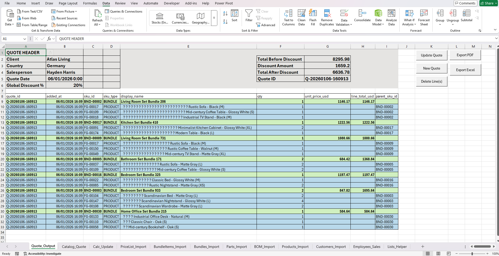

# Dynamic Pricing & Quoting Tool (Excel + VBA) — Furniture Manufacturing

This project is **not a spreadsheet exercise**. It’s a lightweight operational **pricing & quoting system** designed to simulate real workflows in a furniture manufacturing company.

It supports **BOM-driven costing**, **bundles**, **pricing logic + guardrails**, and produces client-ready quotes that can be exported to **PDF** and **clean Excel**.

---

## Why this project (added value)

In real businesses, pricing workflows break when:
- BOM logic isn’t modeled correctly
- bundles double-count costs
- users can enter invalid quantities/prices
- exports look unprofessional or contain macros/links

This tool was built to behave like a **real system**, with:
- clear separation between **price-driving lines** (top-level) and **explanatory components** (child lines)
- validations and guardrails to prevent broken quotes
- print-ready export that fits **one page wide** for PDF

---

## What it does

### Data model
- **Parts** → raw materials & hardware
- **Products (Finished Goods)** → built from parts (BOM logic)
- **Bundles** → sets made of products
- **Price list** → supports PRODUCTS + BUNDLES
- **Customers + Salespeople** → for quote header metadata

### Quote workflow
- Add PRODUCT/BUNDLE from catalog
- Bundles expand into child lines (components)
- Child lines show structure but **don’t carry prices** (to avoid confusion)
- Global Discount % updates totals automatically
- Exports:
  - **PDF** (1 page wide, unlimited height)
  - **Excel** (.xlsx) as **values + formats** (no macros/events)

---

## Key features

✅ BOM & bundle logic  
✅ Cost roll-ups & pricing  
✅ Quote header dropdowns (Client / Country / Salesperson / Date)  
✅ Guardrails:
- no decimal quantities
- block add if unit_price = 0
- block empty bundles  
✅ Formatting hierarchy:
- Top-level lines highlighted
- Child lines indented
- All borders applied  
✅ Exports:
- PDF (client-ready)
- Excel (clean file for ops)

---

## Tech stack

- Microsoft Excel Tables + structured references
- VBA (events, macros, validation, export)

---

## Dataset

No public dataset matched this scenario.  
A realistic dataset was created from scratch using a **designed relational model** and **AI as a controlled data generator** following predefined constraints (volumes, relationships, business rules).

---

## Screenshots

---

## How to run

1. Download `excel/Furniture_Pricing_Quote.xlsm`
2. Enable macros
3. Ensure the import sheets are loaded (Parts / Bundles / BundleItems / PriceList / Customers / Employees)
4. Use `Catalog_Quote` to add items and generate the quote
5. Export to PDF / Excel

---

## Author

Hernan Aronson  
Data & BI Analysis | Analytics, Automation & Impact  
Website: https://www.hernanaronson.com/
LinkedIn: https://www.linkedin.com/in/hernanaronson/
